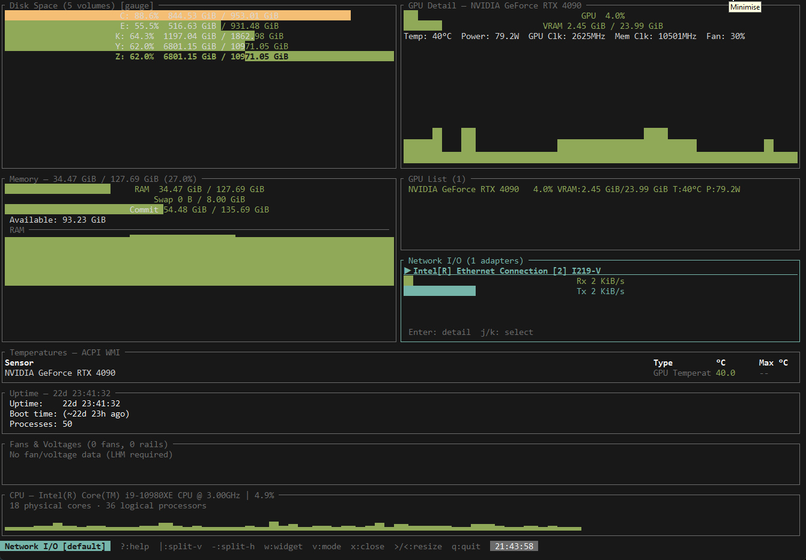

# resource_monitor

A terminal-based system resource monitor for Windows, written in Rust using [ratatui](https://github.com/ratatui-org/ratatui). The UI is fully tile-based: every pane is independently configurable, splittable, resizable, and switchable between 19 widget types, each with three visualization modes.



---

## Features

- Collects CPU, memory, GPU, disk I/O, disk space, network, temperatures, fan speeds, voltages, battery, power draw, process list, and uptime simultaneously on a background thread
- 19 independently configurable widget types, all three visualization modes (default / graph / gauge) per pane
- Binary space partitioning tile layout: split any pane horizontally or vertically, resize splits, close panes
- Spatial focus navigation between panes using hjkl or arrow keys
- Three widgets (Disk Space, Process List, Network I/O) support row selection and inline detail panels opened with Enter
- Temperature data sourced from LibreHardwareMonitor WMI, falling back to ACPI WMI and then PDH thermal zone counters
- CPU power sourced from LibreHardwareMonitor WMI, falling back to PDH RAPL counters
- Network adapters enumerated via PDH; virtual and loopback adapters filtered out automatically
- Physical disk I/O via `IOCTL_DISK_PERFORMANCE`; volume space via `GetDiskFreeSpaceExW` scanning drive letters A through Z
- Process list via `sysinfo`, sorted by CPU usage, top 50 processes tracked
- 120-sample rolling history buffer drives sparklines and graph modes
- Status bar shows focused widget name, current view mode, and a live clock
- UAC manifest requests administrator elevation (required for `IOCTL_DISK_PERFORMANCE` on physical drives)

---

## Requirements

- Windows 10 or Windows 11 (64-bit)
- Rust 1.78 or newer
- A terminal with full Unicode and 256-colour support (Windows Terminal recommended)
- For GPU metrics: an NVIDIA GPU with the NVML library present (`nvml-wrapper` feature, enabled by default)
- For CPU power and temperature detail: [LibreHardwareMonitor](https://github.com/LibreHardwareMonitor/LibreHardwareMonitor) running with WMI reporting enabled (optional; the application falls back gracefully without it)

---

## Building

```
cargo build --release --features nvidia
```

To build without NVIDIA support:

```
cargo build --release --no-default-features
```

The build script (`build.rs`) embeds a UAC manifest that requests `requireAdministrator` elevation. When running tests where UAC is undesirable, use the `test-no-uac` feature to suppress it:

```
cargo test --features "nvidia test-no-uac"
```

---

## Running

```
.\target\release\resource_monitor.exe
```

Because the binary requests administrator elevation, Windows will show a UAC prompt on first launch unless the terminal is already elevated.

---

## Key Bindings

### Global

| Key | Action |
|---|---|
| `?` | Toggle help overlay |
| `q` or `Ctrl+C` | Quit |
| `Esc` | Close help overlay or close any open detail panel |

### Tile navigation

| Key | Action |
|---|---|
| `h` / `←` | Move focus to the pane on the left |
| `l` / `→` | Move focus to the pane on the right |
| `k` / `↑` | Move focus to the pane above |
| `j` / `↓` | Move focus to the pane below |
| `Tab` | Cycle focus forward through all panes |
| `Shift+Tab` | Cycle focus backward through all panes |

### Pane management

| Key | Action |
|---|---|
| `\|` | Split focused pane vertically (left / right) |
| `-` | Split focused pane horizontally (top / bottom) |
| `x` | Close focused pane |
| `w` | Open widget picker for focused pane |
| `v` | Cycle view mode: default → graph → gauge → default |
| `>` | Increase focused pane size ratio |
| `<` | Decrease focused pane size ratio |

### Widget-specific navigation (Disk Space, Process List, Network I/O)

When one of these three widgets is focused, `j`/`k` navigate the list rows rather than moving tile focus.

| Key | Action |
|---|---|
| `j` / `↓` | Select next row |
| `k` / `↑` | Select previous row |
| `Enter` | Toggle inline detail panel for selected row |
| `Esc` | Close detail panel |

### Widget picker

| Key | Action |
|---|---|
| `j` / `↓` | Next widget in list |
| `k` / `↑` | Previous widget in list |
| `Enter` | Assign selected widget to focused pane |
| `Esc` or `w` | Dismiss without changing |

---

## Widgets

All 19 widgets are available in every pane. Each supports three view modes cycled with `v`.

### CPU Overview

Displays global CPU utilisation percentage, model name, core and thread count.

- **Default**: utilisation gauge with a sparkline history below
- **Graph**: full-area sparkline of global CPU utilisation over the last 120 samples
- **Gauge**: single large filled bar

### CPU Cores

Per-logical-core utilisation.

- **Default**: one gauge bar per core, coloured green / yellow / red based on load
- **Graph**: overlapping sparklines for all cores
- **Gauge**: stacked tall gauge bars, one per core

### CPU Frequency

Per-logical-core clock frequency in GHz sourced from `sysinfo`.

- **Default**: one bar per core showing current frequency relative to the highest observed
- **Graph**: sparkline of the average frequency across all cores
- **Gauge**: single large gauge showing average frequency

### CPU Power

Package and core power draw in watts. Primary source is LibreHardwareMonitor WMI; falls back to PDH RAPL counters on supported Intel CPUs.

- **Default**: package watts and core watts with source indicator (LHM / RAPL)
- **Graph**: sparkline of package power over time
- **Gauge**: single large gauge for package power

### GPU Overview

Single-GPU summary: utilisation, VRAM usage, temperature, power, clocks.

- **Default**: utilisation and VRAM gauges with sparkline histories
- **Graph**: utilisation sparkline
- **Gauge**: large utilisation gauge

### GPU Detail

Extended single-GPU information: all clocks, fan speed, power in milliwatts.

- **Default**: full detail table
- **Graph**: VRAM usage sparkline
- **Gauge**: VRAM gauge

### GPU List

Multi-GPU summary table: name, utilisation, VRAM used, temperature, power draw per GPU.

- **Default**: table view
- **Graph**: overlapping utilisation sparklines for all GPUs
- **Gauge**: stacked utilisation gauge bars per GPU

### Memory

RAM utilisation overview: total, used, available, swap.

- **Default**: used RAM gauge and swap gauge with sparkline histories
- **Graph**: RAM used % sparkline
- **Gauge**: tall RAM gauge

### Memory Detail

Extended memory metrics sourced from Windows `GlobalMemoryStatusEx`: commit charge, commit limit, paged pool, non-paged pool.

- **Default**: commit and pool detail lines
- **Graph**: commit percentage sparkline
- **Gauge**: commit gauge and RAM gauge side by side

### Disk I/O

Aggregate physical disk read and write throughput across all detected drives (PhysicalDrive0 through PhysicalDrive15, probed at startup).

- **Default**: read and write gauges with sparkline histories
- **Graph**: read throughput sparkline
- **Gauge**: read and write gauges

### Disk Detail

Per-physical-disk IOPS, queue depth, and latency sourced from `IOCTL_DISK_PERFORMANCE`.

- **Default**: IOPS read/write, queue depth, read latency, write latency per disk
- **Graph**: IOPS read sparkline
- **Gauge**: queue depth gauge bars per disk

### Disk Space

Per-volume used/free space for all drive letters that respond to `GetDiskFreeSpaceExW`.

Supports row selection and inline detail panel:
- `j`/`k` selects a volume; the selected row is highlighted
- `Enter` opens a detail panel at the bottom of the widget showing used, free, and total bytes with percentages, plus the I/O metrics for the associated physical disk (bytes/sec, IOPS, queue depth, latency)

- **Default / Gauge**: one gauge bar per volume coloured by fill percentage
- **Graph**: used% sparkline for the selected volume

### Network I/O

Per-adapter receive and transmit throughput. Adapters are enumerated via `PdhEnumObjectItemsW`; loopback, ISATAP, Teredo, 6-to-4, TAP, Hyper-V, VMware, VirtualBox, and WSL adapters are filtered out.

Supports row selection and inline detail panel:
- `j`/`k` selects an adapter; the selected adapter name is highlighted with a selection indicator
- `Enter` opens a detail panel showing Rx/s, Tx/s, Rx packets/s, Tx packets/s, Rx errors/s, Tx errors/s, and cumulative total Rx/Tx bytes since startup

- **Default / Gauge**: Rx and Tx gauge bars per adapter
- **Graph**: Rx sparkline for the selected adapter

### Fans and Voltages

Fan speeds in RPM and voltage readings sourced from LibreHardwareMonitor WMI.

- **Default**: table of fan RPM readings and voltage values
- **Graph**: fan RPM sparkline for the first fan
- **Gauge**: RPM gauge bars per fan

### Process List

Top 50 processes by CPU usage, refreshed each tick via `sysinfo`.

Supports row selection and inline detail panel:
- `j`/`k` selects a process; the selected row is highlighted in the CPU load colour
- `Enter` opens a detail panel showing PID, CPU%, memory, thread count, start time (formatted as YYYY-MM-DD HH:MM:SS local time via `Win32_System_Time`), and the full path to the executable

- **Default**: scrollable table with columns PID, Name, CPU%, Memory, Threads
- **Graph**: process count sparkline
- **Gauge**: top 5 processes as CPU% gauge bars

### Battery

Battery charge and AC/DC status sourced from `GetSystemPowerStatus`.

- **Default**: charge percentage gauge, AC online / charging indicator, estimated time remaining
- **Graph**: charge percentage sparkline
- **Gauge**: tall charge gauge

### Uptime

System uptime and boot time. View mode has no effect; always displays the same content.

- Uptime formatted as days, hours, minutes, seconds
- Boot date and time
- Total running process count

### Temperatures

Sensor temperature readings. Source priority: LibreHardwareMonitor WMI → ACPI WMI → PDH thermal zone counters.

- **Default**: table of all temperature sensors with current and maximum values
- **Graph**: first sensor sparkline
- **Gauge**: gauge bars per sensor

### System Info

Static summary: CPU model name, physical core and logical thread count, total RAM, GPU count, disk count.

---

## Architecture

```
src/
  main.rs               Entry point, terminal setup, background collector thread
  app.rs                Event loop, tile rendering, key handling, AppState
  metrics/
    mod.rs              All metric structs, MetricsSnapshot, HistoryBuffer (120-sample rolling)
    cpu.rs              CpuCollector via sysinfo
    memory.rs           MemoryCollector via sysinfo + GlobalMemoryStatusEx
    gpu.rs              GpuCollector via nvml-wrapper (NVIDIA) + stub
    disk.rs             DiskCollector (IOCTL_DISK_PERFORMANCE, PhysicalDrive0-15) + volume space
    network.rs          NetworkCollector via PDH; physical adapters only
    temperature.rs      TempCollector; LHM WMI → ACPI WMI → PDH thermal zones
    process.rs          ProcessCollector via sysinfo; top 50 by CPU%
    battery.rs          BatteryCollector via GetSystemPowerStatus
    power.rs            PowerCollector; LHM WMI → PDH RAPL fallback
  ui/
    tiling.rs           BSP tile tree: split, resize, close, spatial focus navigation
    widget_picker.rs    Centered overlay listing all 19 widget kinds
    help.rs             Key binding help overlay
    widgets/
      mod.rs            WidgetKind enum, ViewMode enum, render dispatch, shared helpers
      cpu_overview.rs
      cpu_cores.rs
      cpu_frequency.rs
      cpu_power.rs
      gpu.rs
      gpu_list.rs
      memory.rs
      memory_detail.rs
      disk.rs
      disk_detail.rs
      disk_space.rs     Includes row selection and inline volume detail panel
      network_io.rs     Includes row selection and inline adapter detail panel
      fans_voltages.rs
      process_list.rs   Includes row selection and inline process detail panel
      battery.rs
      uptime.rs
      temperatures.rs
  windows/
    mod.rs
    pdh.rs              PDH helper wrappers (open query, add counter, collect, query value)
```

The background thread collects all metrics every ~500 ms and writes an atomically replaced `MetricsSnapshot` into a shared `Arc<Mutex<MetricsSnapshot>>`. The main thread reads this each tick to update the `HistoryBuffer` and re-render. No metric collection work happens on the main thread.

---

## Metrics Collection Details

### CPU

- Global and per-core utilisation via `sysinfo`
- Per-core frequency in MHz via `sysinfo`
- Model name, physical core count, logical thread count via `sysinfo`

### Memory

- Total, used, available, swap via `sysinfo`
- Commit charge (total and limit), paged pool, non-paged pool via Windows `GlobalMemoryStatusEx`

### GPU

- NVIDIA: utilisation, VRAM used/total, temperature, power in milliwatts, GPU clock, memory clock, fan speed via `nvml-wrapper`
- Non-NVIDIA: stub returning no data

### Disk I/O

- Physical drives PhysicalDrive0 through PhysicalDrive15 are probed at startup
- Each active drive is opened with `CreateFileW` using `FILE_SHARE_READ | FILE_SHARE_WRITE` and queried with `IOCTL_DISK_PERFORMANCE`
- Derived metrics per drive: read bytes/sec, write bytes/sec, IOPS read, IOPS write, queue depth, read latency (ms), write latency (ms)
- Requires administrator privileges

### Disk Space

- Drive letters A through Z are probed each tick via `GetDiskFreeSpaceExW`
- Only letters where the call succeeds and total bytes is non-zero are reported

### Network

- Adapter instance names enumerated via `PdhEnumObjectItemsW` on the `Network Interface` PDH object
- A PDH query is opened once at startup; per-adapter counters for bytes received/sec, bytes sent/sec, packets received/sec, packets sent/sec, receive errors, and transmit errors are added
- Virtual adapters filtered by matching name substrings: loopback, isatap, teredo, 6to4, pseudo, miniport, wsl, hyper-v, virtualbox, vmware, tap
- Cumulative totals are approximated by integrating the per-second rates each tick

### Temperatures, Fans, Voltages

Three-level fallback hierarchy:

1. **LibreHardwareMonitor WMI** (`ROOT\LibreHardwareMonitor`): full sensor data including temperatures, fan RPM, voltages, and power. Requires LHM to be running with WMI enabled.
2. **ACPI WMI** (`ROOT\WMI`): temperature readings only via `MSAcpi_ThermalZoneTemperature`.
3. **PDH thermal zone counters**: temperature readings from `\Thermal Zone Information(*)\Temperature`.

### CPU Power

1. **LibreHardwareMonitor WMI**: package watts and core watts from sensors with `SensorType='Power'`.
2. **PDH RAPL** (`\Power Meter(*)\Power`): supported on Intel CPUs with RAPL exposed via the Windows power meter infrastructure.

### Battery

- `GetSystemPowerStatus` provides charge percentage, AC line status, charging flag, and estimated time remaining in seconds.

### Processes

- Refreshed via `sysinfo::System::refresh_processes` each tick
- Sorted descending by CPU%, with memory as tiebreaker
- Top 50 retained per tick
- Fields collected: PID, name, CPU usage %, memory bytes, thread count, start time (Unix timestamp), executable path

---

## View Modes

Every pane cycles through three view modes independently with `v`:

| Mode | Description |
|---|---|
| `default` | Gauge bars and/or table rows, typically with a small sparkline history row |
| `graph` | The full inner pane area used for a sparkline chart from the 120-sample history |
| `gauge` | One or more large filled bars, no history chart |

The status bar at the bottom of the screen always shows the focused pane's widget name and current mode.

---

## Colour Coding

Percentage-based metrics use a consistent three-band colour scheme:

| Range | Colour |
|---|---|
| 0 – 69% | Green |
| 70 – 89% | Yellow |
| 90 – 100% | Red |

Error counters (network receive/transmit errors) are shown in red when non-zero.

---

## Limitations

- Windows only. The metrics layer compiles on other platforms but returns empty data.
- GPU metrics require an NVIDIA GPU. AMD and Intel GPUs are detected but return no data beyond the name.
- CPU power and fan/voltage data require LibreHardwareMonitor to be running; without it, power falls back to PDH RAPL (Intel only) and fans/voltages show nothing.
- `IOCTL_DISK_PERFORMANCE` requires the process to run as administrator.
- Network cumulative totals (total bytes received/sent) are approximated by summing per-tick byte rates; they reset to zero when the application is restarted.
- The process list is limited to 50 entries sorted by CPU usage. Processes with no CPU activity and lower memory than the 50th entry are not shown.
- Thread count in the process list is reported as zero on non-Linux platforms by `sysinfo`; the field is populated from `p.tasks()` which is only implemented on Linux.

---

## Dependencies

| Crate | Purpose |
|---|---|
| `ratatui` | Terminal UI rendering |
| `crossterm` | Terminal raw mode, alternate screen, event reading |
| `sysinfo` | CPU, memory, process collection |
| `nvml-wrapper` | NVIDIA GPU metrics via NVML |
| `windows` 0.58 | Win32 API bindings (PDH, WMI, disk, power, time) |
| `wmi` 0.14 | WMI query interface for LHM and ACPI namespaces |
| `anyhow` | Error propagation |
| `tokio` | Async runtime (required by `wmi`) |
| `log` + `env_logger` | Diagnostic logging |
| `winres` | Build-time UAC manifest embedding |
